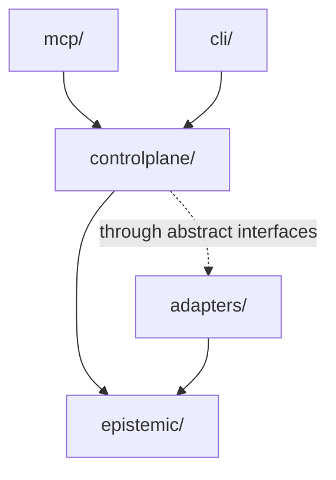
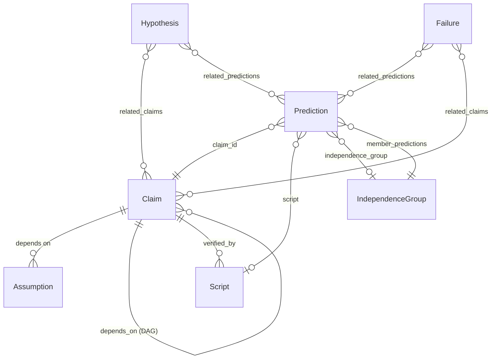
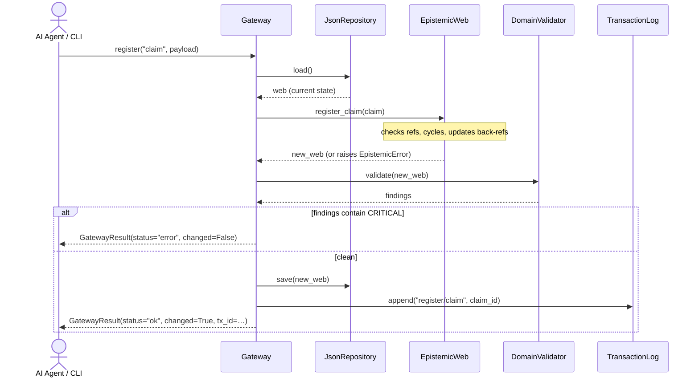
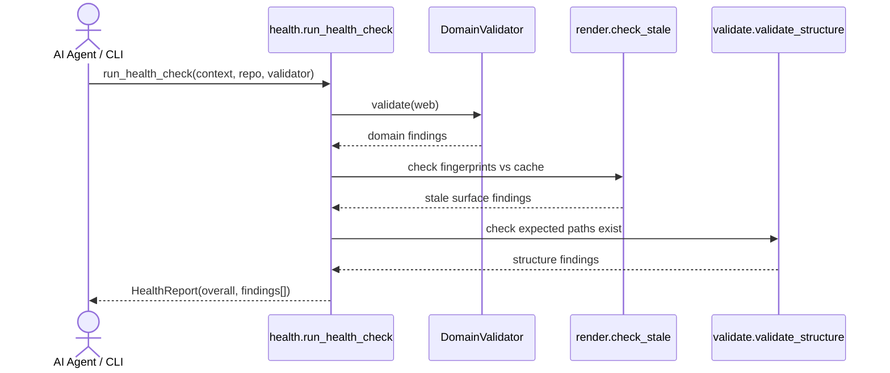
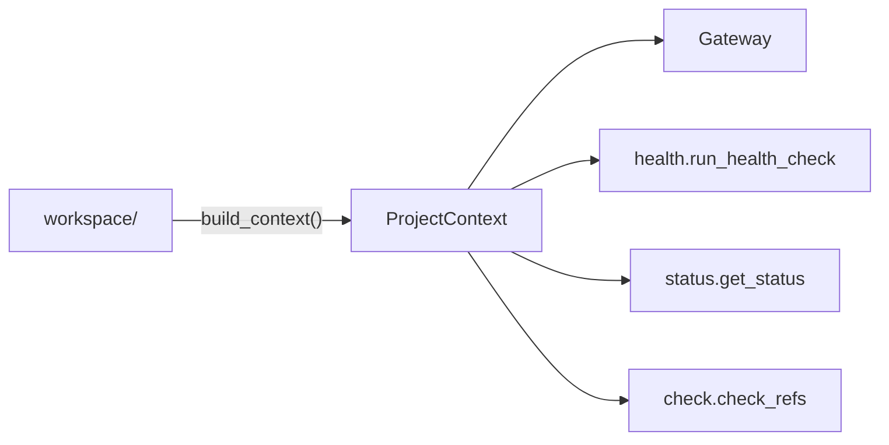
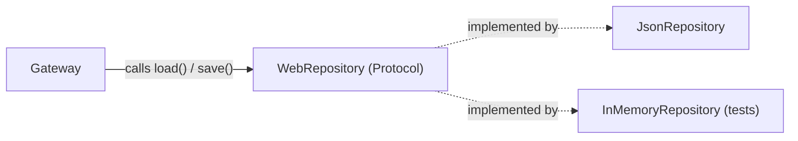

# Architecture

This document explains how Horizon Research works end-to-end: the layer model, the epistemic domain, data flow through the system, key design decisions, and the package dependency rules.

---

## Table of Contents

1. [What Horizon Is](#1-what-horizon-is)
2. [The Layer Cake](#2-the-layer-cake)
3. [The Epistemic Web](#3-the-epistemic-web)
4. [Data Flow: Registering a Claim](#4-data-flow-registering-a-claim)
5. [Data Flow: Health Check](#5-data-flow-health-check)
6. [Package Layout and Dependency Rules](#6-package-layout-and-dependency-rules)
7. [The Gateway](#7-the-gateway)
8. [ProjectContext](#8-projectcontext)
9. [The Adapter Pattern](#9-the-adapter-pattern)
10. [Key Design Decisions](#10-key-design-decisions)

---

## 1. What Horizon Is

### The problem

Research projects accumulate a hidden graph of dependencies between ideas. A claim depends on an assumption. A prediction follows from that claim. A script verifies that prediction. These relationships exist whether or not you track them — but when they're implicit, they break silently: a refuted prediction doesn't update the claims that rely on it, a changed assumption doesn't propagate, and months later nobody knows why a conclusion was drawn.

**Epistemic** means "relating to knowledge and how it's justified." An **epistemic web** is the explicit, machine-checkable graph of those dependencies: what claims exist, what they depend on, what predictions they make, and what evidence supports or refutes them.

Horizon manages that graph.

### Control plane vs. data plane

These terms come from networking and infrastructure (used in Kubernetes, SDN, etc.) but apply cleanly here:

- The **data plane** is the project state that lives on disk: canonical JSON registries of claims and predictions, generated markdown views, verification scripts, and integrity logs. This is the raw material — the research artifacts.
- The **control plane** is the code that *manages* that data plane: it validates consistency, renders views, executes scripts, and exposes everything through a stable API. This is Horizon.
- The **epistemic web** is the in-memory representation of the data plane that the control plane works with — not the whole product, just the domain model at its core.

This means Horizon is not a graph library. It is a product that manages a research project end-to-end, the same way Kubernetes manages a cluster.

---

## 2. The Layer Cake

### What is MCP?

MCP (Model Context Protocol) is an open standard, introduced by Anthropic, that lets AI agents (Claude, Cursor, GitHub Copilot, etc.) call typed tools exposed by a server — similar to how REST APIs expose endpoints, but designed specifically for AI agent use. Instead of an HTTP request, an agent calls a named tool with structured arguments and gets a structured result back. No subprocess wrangling, no screen scraping.

Horizon's primary interface is an MCP server so that an AI agent can call `register_claim(...)` or `run_health_check()` directly as a tool, with full type information and structured responses.

### The layers

```
┌──────────────────────────────────────────────────────┐
│  MCP Server (primary)    │  CLI (secondary)           │
│  AI agents · tools API   │  Humans · scripts · --json │
└────────────────────────┬─────────────────────────────┘
                         │  Both route through the Gateway.
                         │  No MCP-specific or CLI-specific logic.
┌────────────────────────▼─────────────────────────────┐
│  ProjectContext                                       │
│  Runtime contract: paths, config, caches, logs        │
│  Passed explicitly to every service. No globals.      │
└────────────────────────┬─────────────────────────────┘
                         │
┌────────────────────────▼─────────────────────────────┐
│  Control-Plane Services                               │
│  Gateway · Validate · Render · Health · Status        │
│  Check · Metrics · Export                             │
│  Execution Pipeline · Governance (opt-in)             │
└────────────────────────┬─────────────────────────────┘
                         │
┌────────────────────────▼─────────────────────────────┐
│  Domain Core  (epistemic/)                            │
│  EpistemicWeb · entities · invariants · lineage       │
│  Pure Python. Zero I/O. Zero external deps.           │
└────────────────────────┬─────────────────────────────┘
                         │  epistemic/ defines interfaces.
                         │  adapters/ implements them.
┌────────────────────────▼─────────────────────────────┐
│  Infrastructure Adapters                              │
│  JSON repository · Markdown renderer · Sandbox        │
│  Transaction log                                      │
└────────────────────────┬─────────────────────────────┘
                         │
┌────────────────────────▼─────────────────────────────┐
│  Data Plane (filesystem)                              │
│  project/data/*.json · views/ · verify_scripts/       │
│  integrity/query_transaction_log.jsonl                │
└──────────────────────────────────────────────────────┘
```

**Hard dependency rule:** arrows point down only. No layer may import from a layer above it.



The dashed arrow means `controlplane/` uses adapters only through abstract interfaces defined in `epistemic/ports.py` — it never imports a concrete adapter class directly. This is explained in [Section 9](#9-the-adapter-pattern).

---

## 3. The Epistemic Web

### A concrete example first

Consider a physics research project making claims about E8 symmetry theory:

```
Claim C-001: "E8 symmetry predicts the W boson mass"
  └─ depends on Assumption A-001: "The gauge group is compact and simple"
  └─ verified by Script S-001: gauge_couplings.py

Prediction P-001: "W mass = 80.379 GeV"  [Tier A, status: CONFIRMED]
  └─ belongs to Claim C-001
  └─ verified by Script S-001
  └─ member of IndependenceGroup G-001: "electroweak_sector"
  └─ observed value: 80.377 GeV
```

The epistemic web is the live, validated graph of all these relationships across an entire research project. The same structure works for machine learning ("Attention is sufficient for sequence modeling" → BLEU score prediction), medicine (drug trial → hazard ratio prediction), or any empirical discipline.

### Entity types



| Entity | Role |
|--------|------|
| **Claim** | Atomic falsifiable assertion. Forms a DAG via `depends_on` — derived claims build on foundational ones. |
| **Assumption** | Premise taken as given. Empirical [E] assumptions need a falsifiable consequence; methodological [M] ones describe how the study is run. |
| **Prediction** | Testable consequence of a claim. Has a tier, status, and measurement regime. |
| **Script** | Verification program that checks whether a prediction holds. |
| **IndependenceGroup** | A cluster of predictions that share a common derivation. Used to prevent overcounting correlated evidence (e.g., two benchmarks that both come from the same training run aren't independent). Every pair of groups must document *why* they're independent. |
| **Hypothesis** | Higher-level theoretical path being explored. Loosely groups related claims and predictions. |
| **Discovery** | A significant finding during research — something worth recording even if it doesn't fit neatly into claims or predictions. |
| **Failure** | A known problem or dead end. Kept so future work doesn't repeat it. |
| **Concept** | A defined vocabulary term specific to the project. |
| **Parameter** | A physical or mathematical constant (e.g., `c = 3e8 m/s`) injected into verification scripts at runtime so they don't hard-code values. |

### Bidirectional invariants

Three relationships in the web are **bidirectional** — both sides of the link must always agree. This is enforced at mutation time, not checked after the fact.

| If... | Then... |
|-------|---------|
| `claim.assumptions` contains `A-001` | `assumption.used_in_claims` must contain `C-001` |
| `claim.verified_by` contains `S-001` | `script.claims_covered` must contain `C-001` |
| `prediction.independence_group` is `G-001` | `group.member_predictions` must contain `P-001` |

**Why bother?** Without this, a claim can reference an assumption that doesn't know it's being used. If you then ask "which claims depend on A-001?", the answer is wrong — and you might delete A-001 thinking nothing needs it. The bidirectionality makes graph traversal safe in both directions.

### Prediction tiers

| Tier | Constraint | What it means |
|------|-----------|---------------|
| **A** | `free_params == 0` | A pure prediction made before seeing the data. The theory specifies the exact value with no tunable knobs. This is the gold standard — it cannot be retroactively fit to observations. |
| **B** | must set `conditional_on` | Conditional on auxiliary assumptions beyond the core theory. Still a genuine prediction, but weaker than Tier A. |
| **C** | — | A fit or consistency check. Not a novel prediction — the theory was adjusted to match this data. Useful for calibration, not for scoring the theory. |

The tier system exists because not all "confirmed predictions" are equal. A theory that predicted a result before measurement is more credible than one that was tuned to match it. Tiers make that distinction explicit and machine-checkable.

### Copy-on-write mutations

Every `EpistemicWeb` mutation returns a **new web**. The original is untouched.

```python
# Before: web has 5 claims
new_web = web.register_claim(claim)  # web is unchanged; new_web has 6 claims

# If validation fails on new_web, we simply discard it.
# web is still intact — free rollback, no cleanup needed.
```

This is similar to how immutable data structures work in functional programming. The cost is O(n) memory per mutation (a full deep copy), which is acceptable at research scale (hundreds to low thousands of entities). The benefit is that the gateway never needs an explicit undo mechanism.

---

## 4. Data Flow: Registering a Claim



Key properties:

- **Validate-after-write:** the web is mutated in memory first, *then* validated. "After" here means after the in-memory mutation, but *before* writing to disk. If validation finds a CRITICAL issue, the new web is discarded and the original on-disk state is never touched. This is safer than validate-before-write because the validator runs against the exact state that would be saved — not a prediction of it.
- **Single path:** MCP tool handlers and CLI commands call the exact same `Gateway.register()` method. No duplicated logic.
- **Provenance:** every mutation is logged to `query_transaction_log.jsonl` with a UUID and timestamp, regardless of outcome.

---

## 5. Data Flow: Health Check



`HealthReport.overall` is `"HEALTHY"`, `"WARNINGS"`, or `"CRITICAL"` — a single machine-readable signal that CI or an agent can act on without parsing the full findings list.

---

## 6. Package Layout and Dependency Rules

```
src/horizon_research/
├── __init__.py             # version, quick-start imports
├── __main__.py             # python -m horizon_research → CLI
├── config.py               # horizon.toml loading (only file that reads config)
│
├── epistemic/              # ── DOMAIN CORE ─────────────────────────────────
│   ├── types.py            # NewType IDs, enums, Finding dataclass
│   ├── model.py            # Entity @dataclasses (no methods, no I/O)
│   ├── web.py              # EpistemicWeb: owns all mutations to the graph
│   ├── invariants.py       # Pure functions: (EpistemicWeb) -> list[Finding]
│   └── ports.py            # Abstract interfaces (WebRepository, etc.)
│
├── controlplane/           # ── CONTROL PLANE ───────────────────────────────
│   ├── context.py          # ProjectContext, HorizonConfig, ProjectPaths
│   ├── gateway.py          # Gateway class + GatewayResult envelope
│   ├── validate.py         # validate_project, validate_structure
│   ├── render.py           # SHA-256 fingerprint cache + incremental render
│   ├── check.py            # check_refs, check_stale, sync_prose
│   ├── metrics.py          # compute_metrics, tier_a_evidence_summary
│   ├── health.py           # run_health_check → HealthReport
│   ├── status.py           # get_status → ProjectStatus
│   ├── export.py           # export_json, export_markdown
│   ├── automation.py       # render trigger table
│   ├── execution/
│   │   ├── scripts.py      # run_script, run_all_scripts
│   │   ├── policy.py       # ExecutionPolicy, resolve_policy
│   │   └── meta_verify.py  # post-run integrity checks
│   └── governance/         # opt-in; inactive when governance_enabled=False
│       ├── session.py      # open/close/list sessions
│       ├── boundary.py     # check_boundary (no-op when disabled)
│       └── close.py        # close-gate validation + git publish
│
├── adapters/               # ── INFRASTRUCTURE ──────────────────────────────
│   ├── json_repository.py  # implements WebRepository
│   ├── markdown_renderer.py# implements WebRenderer
│   ├── sandbox_executor.py # implements ScriptExecutor
│   └── transaction_log.py  # implements TransactionLog
│
├── mcp/                    # ── MCP INTERFACE ───────────────────────────────
│   ├── server.py           # FastMCP server, tool registration
│   └── tools.py            # tool handlers → thin wrappers over Gateway
│
└── cli/                    # ── CLI INTERFACE ───────────────────────────────
    ├── main.py             # Click command tree
    └── formatters.py       # Rich tables + JSON fallback
```

### Allowed import directions

| From | May import | May NOT import |
|------|-----------|----------------|
| `epistemic/` | stdlib only | anything above |
| `controlplane/` | `epistemic/`, stdlib | `adapters/`, `mcp/`, `cli/` |
| `adapters/` | `epistemic/`, stdlib | `controlplane/`, `mcp/`, `cli/` |
| `mcp/` | `controlplane/`, `adapters/`, `epistemic/` | `cli/` |
| `cli/` | `controlplane/`, `adapters/`, `epistemic/` | `mcp/` |

`controlplane/` accesses adapters **only through the abstract interfaces defined in `epistemic/ports.py`** — it never imports a concrete adapter class directly. Concrete adapters are wired together in `mcp/tools.py` and `cli/main.py` at startup when the Gateway is constructed.

---

## 7. The Gateway

The Gateway is the **single mutation and query boundary**. Both MCP tool handlers and CLI commands call it. There is no other way to mutate the epistemic web.

```python
class Gateway:
    def register(self, resource: str, payload: dict, *, dry_run: bool) -> GatewayResult
    def get(self, resource: str, identifier: str) -> GatewayResult
    def list(self, resource: str, **filters) -> GatewayResult
    def set(self, resource: str, identifier: str, payload: dict, *, dry_run: bool) -> GatewayResult
    def transition(self, resource: str, identifier: str, new_status: str, *, dry_run: bool) -> GatewayResult
    def query(self, query_type: str, **params) -> GatewayResult
```

All operations return a `GatewayResult`:

```python
@dataclass
class GatewayResult:
    status: str           # "ok" | "error" | "CLEAN" | "BLOCKED" | "dry_run"
    changed: bool         # True if on-disk state was modified
    message: str          # human-readable summary
    findings: list[Finding]
    transaction_id: str | None  # set on successful mutations; None for reads
    data: dict | None           # populated for get/list/query results
```

This envelope is the contract between the Gateway and both interfaces. MCP tools serialize it to a dict. The CLI formatter renders it with Rich.

`dry_run=True` runs the full mutation and validation pipeline in memory but skips the `repo.save()` call — useful for checking whether a change would be accepted before committing it.

### Resource aliases

The gateway accepts flexible resource names and resolves them to canonical keys, so CLI users and agents can use natural language forms:

```python
GATEWAY_RESOURCE_ALIASES = {
    "claim": "claim", "claims": "claim",
    "prediction": "prediction", "predictions": "prediction",
    "independence-group": "independence_group",
    # ...
}
```

Adding a new resource type means one entry in this table, not a new handler class.

### Transaction lifecycle

```
1. resolve_resource(alias)       → canonical key (raises KeyError if unknown)
2. repo.load()                   → current EpistemicWeb from disk
3. web.register_*(entity)        → new EpistemicWeb in memory
                                   raises EpistemicError on broken refs, cycles, duplicates
4. validator.validate(new_web)   → list[Finding]
5. if any CRITICAL findings      → discard new_web, return GatewayResult(status="error")
                                   on-disk state is untouched
6. repo.save(new_web)            → write to disk (atomic rename)
7. tx_log.append(op, id)         → append provenance record, get transaction_id
8. return GatewayResult(status="ok", changed=True, tx_id=…)
```

---

## 8. ProjectContext

`ProjectContext` is the runtime configuration object passed to every control-plane service. It carries data, not callbacks — no hidden collaborators, no module-level globals, no monkey-patching.

```python
@dataclass
class ProjectContext:
    workspace: Path
    config: HorizonConfig       # governance_enabled, project_dir, …
    paths: ProjectPaths         # all derived filesystem paths, computed once at startup
```

`ProjectPaths` is computed once in `build_context()` and never re-derived. Every service that needs a file path reads it from `context.paths` — no service computes paths on its own. This makes services fully testable: pass in a `ProjectContext` pointing at a temp directory, and nothing touches the real filesystem.



---

## 9. The Adapter Pattern

### The problem it solves

The domain core (`epistemic/`) needs to load and save the web, render views, and execute scripts — but it shouldn't know whether storage is JSON files, a database, or an in-memory dict. Hardcoding `JsonRepository` into the domain would mean:
- Tests would need real JSON files
- Swapping to a different storage format would require changing domain code

### How it works

`epistemic/ports.py` defines **what the domain needs** from infrastructure using Python `Protocol` classes. A `Protocol` is Python's version of a structural interface: any class that has the right methods satisfies it, without needing to inherit from it. This is sometimes called "duck typing with type checking."

```python
# epistemic/ports.py — the interface (what the domain requires)
class WebRepository(Protocol):
    def load(self) -> EpistemicWeb: ...
    def save(self, web: EpistemicWeb) -> None: ...

# adapters/json_repository.py — one concrete implementation
class JsonRepository:
    def load(self) -> EpistemicWeb: ...   # reads project/data/*.json
    def save(self, web: EpistemicWeb) -> None: ...

# In tests: a fake that needs no files at all
class InMemoryRepository:
    def __init__(self, web: EpistemicWeb): self._web = web
    def load(self) -> EpistemicWeb: return self._web
    def save(self, web: EpistemicWeb) -> None: self._web = web
```

The `Gateway` receives a `WebRepository` — it never imports `JsonRepository` directly. The concrete adapter is injected at startup in `mcp/tools.py` and `cli/main.py`. This pattern is sometimes called "dependency injection" or "ports and adapters" (Hexagonal Architecture).



---

## 10. Key Design Decisions

### Immutable mutations (copy-on-write)

Every `EpistemicWeb` mutation returns a new web. This is O(n) per mutation (a full deep copy) but correct and simple. For research-scale webs (hundreds to low thousands of entities) this is fast enough. The benefit: free rollback — the gateway holds the pre-mutation web and discards the new one if validation fails, with no undo stack, no transaction log, no compensating operations.

If this ever becomes a performance bottleneck, the migration path is structural sharing of unchanged sub-dicts (similar to persistent data structures in Clojure). That's not a change to make speculatively.

### Native Python types

Entities use `dict`, `set`, `list` — not `frozenset`, `Mapping`, or `tuple`. The `EpistemicWeb` and the gateway are the encapsulation boundaries, not the container types. This keeps entity construction simple and removes friction when writing tests: you can construct any entity with plain Python literals.

### Structural vs. semantic invariants

There are two categories of constraint, enforced at different times:

- **Structural invariants** (referential integrity, DAG acyclicity, bidirectional links) are enforced *inside* `EpistemicWeb.register_*` at mutation time. They are guaranteed by construction — it is impossible to create an `EpistemicWeb` that violates them.
- **Semantic invariants** (tier constraints, coverage gaps, independence semantics) live in `invariants.py` and are checked on demand by the validator. They represent best-practice rules that may legitimately be incomplete during active research.

### One gateway, two interfaces

MCP and CLI are presentations, not implementations. All business logic lives in the gateway. This means:
- A bug fixed in the gateway is fixed for both interfaces simultaneously
- Adding a new resource type requires no changes to MCP or CLI dispatch logic
- Testing the gateway fully tests the product behaviour

### Governance is opt-in

`governance/` is entirely inactive when `governance_enabled = false` (the default). The `check_boundary()` call in the gateway is a no-op. No governance code runs on the hot path for projects that don't need it. Enabling governance adds session boundaries and close-gate validation without changing any other behaviour.

### Dependency inversion at every boundary

```
mcp/cli  →  controlplane  →  epistemic  ←  adapters
```

`epistemic/` defines the interfaces. `adapters/` implements them. `controlplane/` uses them. The domain has zero knowledge of JSON files, markdown, subprocesses, or the MCP protocol. This means the entire domain and control plane can be tested in memory without touching the filesystem.
