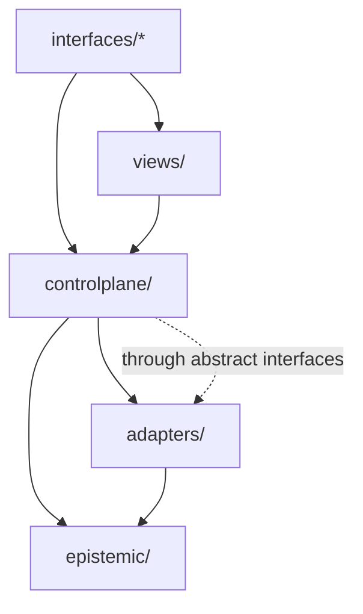
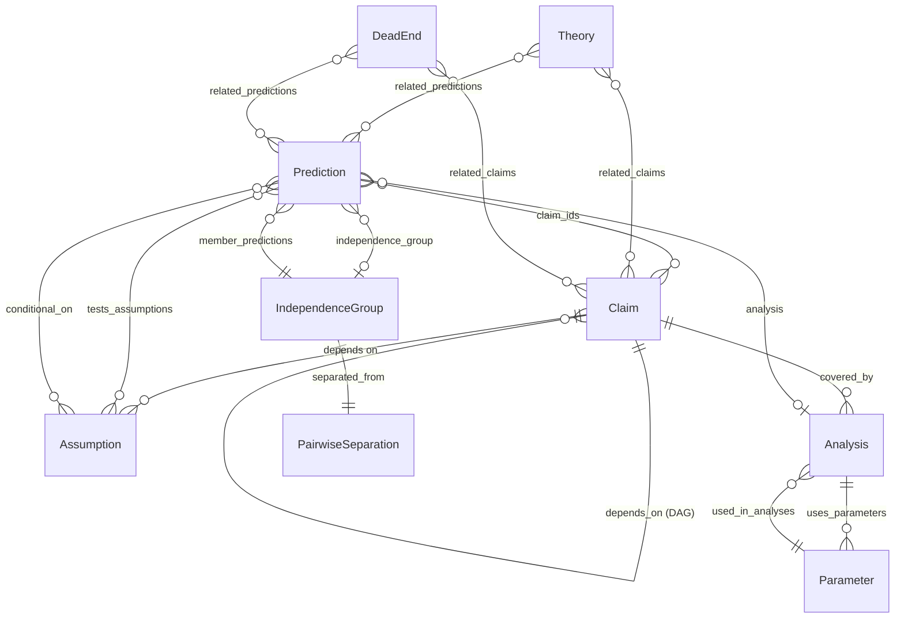
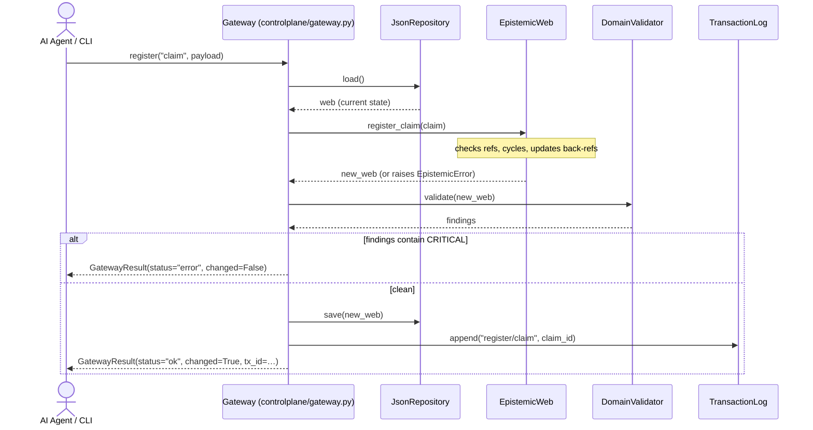
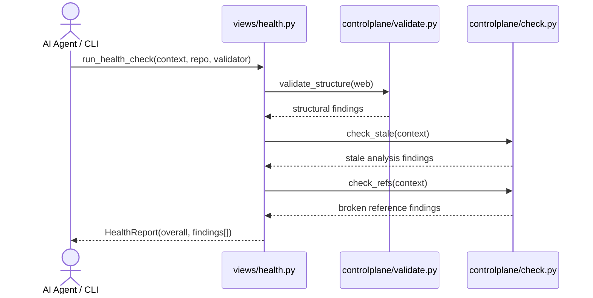
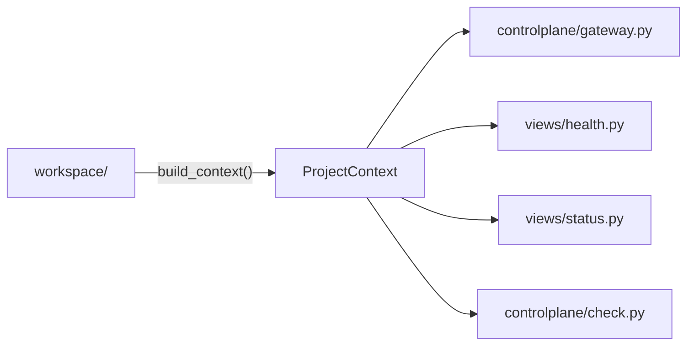
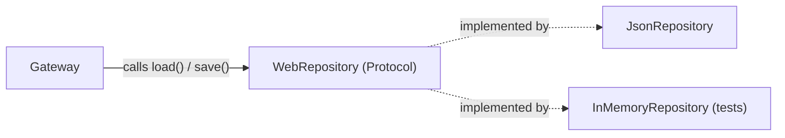

# Architecture

This document explains how deSitter works end-to-end: the layer model, the epistemic domain, data flow through the system, key design decisions, and the package dependency rules.

---

## Table of Contents

1. [What deSitter Is](#1-what-desitter-is)
2. [The Layer Cake](#2-the-layer-cake)
3. [The Epistemic Web](#3-the-epistemic-web)
4. [Data Flow: Registering a Claim](#4-data-flow-registering-a-claim)
5. [Data Flow: Health Check](#5-data-flow-health-check)
6. [Package Layout and Dependency Rules](#6-package-layout-and-dependency-rules)
7. [The Gateway](#7-the-gateway)
8. [ProjectContext](#8-projectcontext)
9. [The Adapter Pattern](#9-the-adapter-pattern)
10. [Key Design Decisions](#10-key-design-decisions)

---

## 1. What deSitter Is

### The problem

Research projects accumulate a hidden graph of dependencies between ideas. A claim depends on an assumption. A prediction follows from that claim. An analysis tests that prediction. These relationships exist whether or not you track them — but when they're implicit, they break silently: a refuted prediction doesn't update the claims that rely on it, a changed assumption doesn't propagate, and months later nobody knows why a conclusion was drawn.

**Epistemic** means "relating to knowledge and how it's justified." An **epistemic web** is the explicit, machine-checkable graph of those dependencies: what claims exist, what they depend on, what predictions they make, and what evidence supports or refutes them.

deSitter manages that graph.

### The Audit Scaffold Principle

deSitter is an **audit scaffold**, not a reasoning engine. It surfaces structural facts about the epistemic graph — missing links, untested assumptions, uncovered predictions — and gives researchers and AI agents the navigational structure to do their own reasoning.

**What deSitter does:**
- Records the structure of the epistemic graph
- Enforces referential integrity and bidirectional invariants
- Reports structural observations (`StructuralGap`, `Finding`)
- Exposes a traversal API so agents can navigate the graph

**What deSitter does not do:**
- Make logical judgments about whether a theory is correct
- Prescribe which experiments to run
- Suggest how to fix a structural gap
- Execute analyses (the researcher runs them; deSitter records the results)

This distinction matters. An AI agent calling `get_structural_gaps` gets a list of observations — "Assumption A-003 has a falsifiable consequence but no predictions in `tested_by`" — and applies its own domain knowledge to decide what to do about it. deSitter provides the map. The researcher or agent is the auditor.

### Control plane vs. data plane

- The **data plane** is the project state on disk: canonical JSON registries of claims and predictions, generated markdown views, recorded analysis results. This is the research artifact.
- The **control plane** is the code that manages that data plane: validates consistency, renders views, records results, and exposes everything through a stable API. This is deSitter.
- The **epistemic web** is the in-memory representation of the data plane that the control plane works with — the domain model at the core.

---

## 2. The Layer Cake

### What is MCP?

MCP (Model Context Protocol) is an open standard that lets AI agents (Claude, Cursor, GitHub Copilot, etc.) call typed tools exposed by a server — similar to REST APIs, but designed specifically for AI agent use. Instead of an HTTP request, an agent calls a named tool with structured arguments and gets a structured result back. No subprocess wrangling, no screen scraping.

deSitter's MCP server is the primary interface for AI agents. An agent calls `register_claim(...)` or `run_health_check()` directly as a tool, with full type information and structured responses.

### The layers

```
┌──────────────────────────────────────────────────────┐
│  Interface Layer (interfaces/) — equal peers         │
│  cli/  Humans + scripts       mcp/  AI agents        │
│  rest/ future · gui/ future · sdk/ future            │
└─────────────────────┬────────────────────────────────┘
                      │  (no business logic in any interface)
┌─────────────────────▼────────────────────────────────┐
│  View Services (views/) — always available           │
│  health · render · status · metrics                  │
│  Read-only composed summaries + derived files        │
└─────────────────────┬────────────────────────────────┘
                      │
┌─────────────────────▼────────────────────────────────┐
│  Core Services (controlplane/) — always available            │
│  Mutations:  gateway · results                       │
│  Queries:    validate · check · export               │
│  Policy:     automation (render-trigger table)       │
└─────────────────────┬────────────────────────────────┘
                      │
┌─────────────────────▼────────────────────────────────┐
│  Config (config.py) — runtime contract               │
│  DesitterConfig · ProjectContext · ProjectPaths       │
│  load_config() · build_context()                     │
└─────────────────────┬────────────────────────────────┘
                      │
┌─────────────────────▼────────────────────────────────┐
│  Infrastructure Adapters (adapters/)                 │
│  json_repository · transaction_log                   │
│  markdown_renderer                                   │
└─────────────────────┬────────────────────────────────┘
                      │
┌─────────────────────▼────────────────────────────────┐
│  Epistemic Kernel (epistemic/) — pure Python, no I/O │
│  model · web · invariants · types · ports            │
└──────────────────────────────────────────────────────┘
                      │
┌─────────────────────▼────────────────────────────────┐
│  Data Plane — filesystem                             │
│  project/data/ (entity JSON) · project/views/ (md)  │
└──────────────────────────────────────────────────────┘
```

**Hard dependency rule:** arrows point down only. No layer may import from a layer above it.



The dashed arrow means `controlplane/` uses adapters only through abstract interfaces defined in `epistemic/ports.py` — it never imports a concrete adapter class directly. Concrete adapters are wired together in the interface layer at startup when the Gateway is constructed.

### Interface layer design

All entry points live under `interfaces/` as equal peers. No interface is primary:

- `interfaces/cli/` — humans and scripts (Click commands + Rich formatting)
- `interfaces/mcp/` — AI agents (FastMCP tools)
- `interfaces/rest/` — future REST API
- `interfaces/gui/` — future web UI
- `interfaces/sdk/` — future Python SDK

Every interface is a **thin adapter**: parse inputs, call the same controlplane/views/features function, format outputs. If a handler contains business logic, it belongs in `controlplane/` or `views/` instead.

One exception: agent scaffolding (`.desitter/agents.md`, `get_protocol`, `ds init --with-agent`) lives in `interfaces/mcp/` only. It is AI-agent-specific documentation infrastructure, not shared product logic.

---

## 3. The Epistemic Web

### A concrete example first

Consider a physics research project making claims about E8 symmetry theory:

```
Claim C-001: "E8 symmetry predicts the W boson mass"
  └─ depends on Assumption A-001: "The gauge group is compact and simple"
  └─ covered by Analysis AN-001: gauge_couplings.py

Prediction P-001: "W mass = 80.379 GeV"  [Tier A, status: CONFIRMED]
  └─ follows from Claim C-001
  └─ tested by Analysis AN-001
  └─ member of IndependenceGroup G-001: "electroweak_sector"
  └─ observed value: 80.377 GeV
```

The epistemic web is the live, validated graph of all these relationships across an entire research project. The same structure works for machine learning ("Attention is sufficient for sequence modeling" → BLEU score prediction), medicine (drug trial → hazard ratio prediction), or any empirical discipline.

### Entity types



| Entity | Role |
|--------|------|
| **Claim** | Atomic falsifiable assertion. Forms a DAG via `depends_on` — derived claims build on foundational ones. `parameter_constraints` is an annotation map `{ParameterId: constraint_str}` — deSitter surfaces these when the referenced parameter changes so the researcher knows to re-check the claim. |
| **Assumption** | Premise taken as given. Empirical [E] assumptions may have a `falsifiable_consequence`; methodological [M] ones describe how the study is run. `depends_on` captures presupposition chains between assumptions. |
| **Prediction** | Testable consequence of one or more claims. Has a tier, status, and measurement regime. `claim_ids` is the full set of claims that jointly imply this prediction. `tests_assumptions` marks assumptions under active test; `conditional_on` marks assumptions taken as given for the prediction to be valid. |
| **Analysis** | A piece of analytical work. deSitter never runs it — the researcher runs it and records the result via `ds record` or the `record_result` MCP tool. `path` and `command` are provenance pointers. `uses_parameters` links to all parameters the analysis depends on, enabling staleness detection. |
| **IndependenceGroup** | A cluster of predictions sharing a common derivation chain. Prevents overcounting correlated evidence — two analyses that both depend on the same data aren't independent. |
| **PairwiseSeparation** | Documents the explicit justification for why two independence groups are genuinely separate. Every pair of groups must have a separation record — enforced by `validate_independence_semantics`. |
| **Theory** | Higher-level explanatory framework. Organises related claims and predictions. |
| **Discovery** | A significant finding worth recording, even if it doesn't fit neatly into claims or predictions. |
| **DeadEnd** | A known dead end or abandoned direction. Valuable negative results that constrain the hypothesis space. |
| **Concept** | A defined vocabulary term specific to the project. |
| **Parameter** | A physical or mathematical constant (e.g., `c = 3e8 m/s`) referenced by analyses. Enables staleness detection: when a parameter changes, `check_stale` identifies which analyses need re-running. `used_in_analyses` is the bidirectional backlink maintained automatically by the web. |

### Bidirectional invariants

Five relationships in the web are **bidirectional** — both sides of the link must always agree. This is enforced at mutation time, not checked after the fact.

| If... | Then... |
|-------|---------|
| `claim.assumptions` contains `A-001` | `assumption.used_in_claims` must contain `C-001` |
| `analysis.claims_covered` contains `C-001` | `claim.analyses` must contain `AN-001` |
| `prediction.independence_group` is `G-001` | `group.member_predictions` must contain `P-001` |
| `prediction.tests_assumptions` contains `A-001` | `assumption.tested_by` must contain `P-001` |
| `analysis.uses_parameters` contains `PAR-001` | `parameter.used_in_analyses` must contain `AN-001` |

**Why bother?** Without this, a claim can reference an assumption that doesn't know it's being used. If you ask "which claims depend on A-001?", the answer is wrong — and you might delete A-001 thinking nothing needs it. Bidirectionality makes graph traversal safe in both directions.

### Domain invariant validators

Ten pure validator functions in `epistemic/invariants.py` check the web on demand. Each takes an `EpistemicWeb` and returns `list[Finding]`. `validate_all` composes them.

| Validator | What it checks |
|-----------|----------------|
| `validate_tier_constraints` | Tier A predictions have 0 free params; Tier B have `conditional_on`; MEASURED predictions have an observed value |
| `validate_independence_semantics` | Group membership consistency; every group pair has a `PairwiseSeparation` |
| `validate_coverage` | Claims without analyses; Tier A predictions without independence groups |
| `validate_assumption_testability` | Empirical assumptions with a `falsifiable_consequence` but no `tested_by` predictions |
| `validate_retracted_claim_citations` | Predictions and claims that still cite retracted claims |
| `validate_implicit_assumption_coverage` | Predictions that implicitly rest on empirical assumptions not in `tests_assumptions` |
| `validate_tests_conditional_overlap` | Predictions where `tests_assumptions` and `conditional_on` share the same assumption (conflicting signals) |
| `validate_foundational_claim_deps` | Foundational claims that incorrectly have `depends_on` entries |
| `validate_evidence_consistency` | CONFIRMED/REFUTED predictions without a linked analysis; analyses with no linked predictions |
| `validate_all` | Composite — runs all validators and returns merged findings |

### Mutation API

`EpistemicWeb` exposes a full copy-on-write mutation API. All methods return a **new web**; the original is untouched.

| Method family | Entities covered |
|---------------|------------------|
| `register_*(entity)` | All 11 entity types: claim, assumption, prediction, analysis, theory, independence_group, discovery, dead_end, concept, parameter, pairwise_separation |
| `update_*(entity)` | claim, assumption, prediction, analysis, theory, independence_group, discovery, dead_end, concept, parameter, pairwise_separation |
| `remove_*(id)` | prediction, claim, assumption, parameter |
| `transition_*(id, new_status)` | prediction, claim, theory, discovery, dead_end |

All `register_*` and `update_*` methods enforce referential integrity (no broken IDs), check for cycles where applicable, and maintain all bidirectional links atomically.

### Traversal and impact queries

The web exposes a set of pure query methods for navigating the graph and computing blast radii. These are the primary tools for AI agents and health-check services.

| Method | Returns | Use case |
|--------|---------|----------|
| `claim_lineage(cid)` | `set[ClaimId]` | All ancestor claims via `depends_on` (transitive closure) |
| `assumption_lineage(cid)` | `set[AssumptionId]` | All assumptions reachable from a claim and its ancestors, including assumption presupposition chains |
| `prediction_implicit_assumptions(pid)` | `set[AssumptionId]` | Every assumption a prediction silently rests on, including `conditional_on` and all assumption `depends_on` chains |
| `refutation_impact(pid)` | `{claim_ids, claim_ancestors, implicit_assumptions}` | What is called into question when a prediction is refuted |
| `assumption_support_status(aid)` | `{direct_claims, dependent_predictions, tested_by}` | Everything that depends on an assumption, directly and transitively |
| `claims_depending_on_claim(cid)` | `set[ClaimId]` | All downstream claims built on this claim (forward traversal) |
| `predictions_depending_on_claim(cid)` | `set[PredictionId]` | All predictions whose derivation chain includes this claim |
| `parameter_impact(pid)` | `{stale_analyses, constrained_claims, affected_claims, affected_predictions}` | Full blast radius of a parameter change |

### Prediction tiers

| Tier | Constraint | What it means |
|------|-----------|---------------|
| **A** | `free_params == 0` | A pure prediction made before seeing the data. No tunable knobs. The gold standard. |
| **B** | must set `conditional_on` | Conditional on auxiliary assumptions beyond the core theory. Still a genuine prediction, but weaker than Tier A. |
| **C** | — | A fit or consistency check. Not a novel prediction — the theory was adjusted to match this data. |

The tier system makes the distinction between "predicted before measurement" and "fit after measurement" explicit and machine-checkable.

### Copy-on-write mutations

Every `EpistemicWeb` mutation returns a **new web**. The original is untouched.

```python
# Before: web has 5 claims
new_web = web.register_claim(claim)  # web is unchanged; new_web has 6 claims

# If validation fails on new_web, we simply discard it.
# web is still intact — free rollback, no cleanup needed.
```

The cost is O(n) memory per mutation (a full deep copy), acceptable at research scale. The benefit: the gateway never needs an explicit undo mechanism.

---

## 4. Data Flow: Registering a Claim



Key properties:

- **Validate-after-write:** the web is mutated in memory first, *then* validated — but *before* writing to disk. If validation finds a CRITICAL issue, the new web is discarded and the original on-disk state is never touched.
- **Single path:** MCP tool handlers and CLI commands call the exact same `Gateway.register()` method. No duplicated logic anywhere.
- **Provenance:** every mutation is logged to the transaction log with a UUID and timestamp, regardless of outcome.

---

## 5. Data Flow: Health Check



`HealthReport.overall` is `"HEALTHY"`, `"WARNINGS"`, or `"CRITICAL"` — a single machine-readable signal that CI or an agent can act on without parsing the full findings list.

---

## 6. Package Layout and Dependency Rules

```
src/desitter/
├── __init__.py                  # version, public API re-exports
├── __main__.py                  # python -m desitter → CLI
├── config.py                    # DesitterConfig, ProjectContext, ProjectPaths,
│                                #   load_config(), build_context()
│
├── epistemic/                   # ── DOMAIN KERNEL ───────────────────────────
│   ├── types.py                 # NewType IDs, enums, Finding, Severity
│   ├── model.py                 # Entity @dataclasses — no methods, no I/O
│   ├── web.py                   # EpistemicWeb: all mutations to the graph
│   ├── invariants.py            # Pure functions: (EpistemicWeb) -> list[Finding]
│   └── ports.py                 # Abstract interfaces (WebRepository, WebRenderer, …)
│
├── adapters/                    # ── INFRASTRUCTURE ──────────────────────────
│   ├── json_repository.py       # implements WebRepository
│   ├── markdown_renderer.py     # implements WebRenderer
│   └── transaction_log.py       # implements TransactionLog ✔ done
│                                # results_repository.py — Phase 6
│
├── controlplane/                        # ── CORE SERVICES ───────────────────────────
│   ├── gateway.py               # Single mutation/query boundary + GatewayResult
│   ├── validate.py              # validate_project, validate_structure
│   ├── check.py                 # check_stale, check_refs, sync_prose
│   ├── export.py                # export_json, export_markdown
│   └── automation.py            # Render-trigger policy table ✔ done
│                                # results.py — Phase 6
│
├── views/                       # ── VIEW SERVICES ───────────────────────────
│   ├── health.py                # run_health_check → HealthReport
│   ├── render.py                # SHA-256 fingerprint cache + incremental render
│   ├── status.py                # get_status → ProjectStatus
│   └── metrics.py               # compute_metrics, tier_a_evidence_summary
│
└── interfaces/                  # ── INTERFACE ADAPTERS ──────────────────────
    ├── __init__.py              # Interface layer contract documentation
    ├── cli/                     # Humans + scripts
    │   ├── main.py              # Click command tree
    │   └── formatters.py        # Rich tables + JSON fallback
    └── mcp/                     # AI agents
        ├── server.py            # FastMCP entry point
        └── tools.py             # Tool handlers → thin wrappers over controlplane/views
        # future: rest/, gui/, sdk/ go here as equal peers
```

### Allowed import directions

| From | May import | May NOT import |
|------|-----------|----------------|
| `epistemic/` | stdlib only | anything |
| `adapters/` | `epistemic/`, stdlib | `controlplane/`, `views/`, `interfaces/` |
| `config.py` | stdlib only | anything |
| `controlplane/` | `epistemic/`, `adapters/` (via protocols), `config` | `views/`, `interfaces/` |
| `views/` | `controlplane/`, `epistemic/`, `config` | `interfaces/` |
| `interfaces/*` | all layers above | other interfaces (e.g. `cli/` cannot import `mcp/`) |

`controlplane/` accesses adapters **only through the abstract interfaces defined in `epistemic/ports.py`** — it never imports a concrete adapter class directly. Concrete adapters are wired in the interface layer at startup when the Gateway is constructed.

---

## 7. The Gateway

The Gateway is the **single mutation and query boundary**. Both MCP tool handlers and CLI commands call it. There is no other way to mutate the epistemic web.

```python
class Gateway:
    def register(self, resource: str, payload: dict, *, dry_run: bool) -> GatewayResult
    def get(self, resource: str, identifier: str) -> GatewayResult
    def list(self, resource: str, **filters) -> GatewayResult
    def set(self, resource: str, identifier: str, payload: dict, *, dry_run: bool) -> GatewayResult
    def transition(self, resource: str, identifier: str, new_status: str, *, dry_run: bool) -> GatewayResult
    def query(self, query_type: str, **params) -> GatewayResult
```

All operations return a `GatewayResult`:

```python
@dataclass
class GatewayResult:
    status: str           # "ok" | "error" | "CLEAN" | "BLOCKED" | "dry_run"
    changed: bool         # True if on-disk state was modified
    message: str          # human-readable summary
    findings: list[Finding]
    transaction_id: str | None  # set on successful mutations; None for reads
    data: dict | None           # populated for get/list/query results
```

This envelope is the contract between the Gateway and all interfaces. MCP tools serialize it to a dict. The CLI formatter renders it with Rich. A future REST API would serialize it to JSON. The contract never changes shape — only how it is presented changes.

`dry_run=True` runs the full mutation and validation pipeline in memory but skips `repo.save()` — useful for checking whether a change would be accepted before committing it.

### Resource aliases

The gateway accepts flexible resource names and resolves them to canonical keys:

```python
GATEWAY_RESOURCE_ALIASES = {
    "claim": "claim", "claims": "claim",
    "prediction": "prediction", "predictions": "prediction",
    "analysis": "analysis", "analyses": "analysis",
    "independence-group": "independence_group",
    # ...
}
```

Adding a new resource type means one entry in this table.

### Transaction lifecycle

```
1. resolve_resource(alias)       → canonical key (raises KeyError if unknown)
2. repo.load()                   → current EpistemicWeb from disk
3. web.register_*(entity)        → new EpistemicWeb in memory
                                   raises EpistemicError on broken refs, cycles, duplicates
4. validator.validate(new_web)   → list[Finding]
5. if any CRITICAL findings      → discard new_web, return GatewayResult(status="error")
                                   on-disk state is untouched
6. repo.save(new_web)            → write to disk (atomic rename)
7. tx_log.append(op, id)         → append provenance record, get transaction_id
8. return GatewayResult(status="ok", changed=True, tx_id=…)
```

---

## 8. ProjectContext

`ProjectContext` is the runtime configuration object passed to every service. It carries data, not callbacks — no hidden collaborators, no module-level globals.

```python
@dataclass
class ProjectContext:
    workspace: Path
    config: DesitterConfig    # project_dir, …
    paths: ProjectPaths      # all derived filesystem paths, computed once at startup
```

`ProjectPaths` is computed once in `build_context()` and never re-derived. Every service that needs a file path reads it from `context.paths`. This makes all services fully testable: pass in a `ProjectContext` pointing at a temp directory and nothing touches the real filesystem.



---

## 9. The Adapter Pattern

### The problem it solves

The domain core (`epistemic/`) needs to load and save the web, render views, and record results — but it shouldn't know whether storage is JSON files, a database, or an in-memory dict. Hardcoding `JsonRepository` into the domain would mean tests need real JSON files and swapping storage formats would require changing domain code.

### How it works

`epistemic/ports.py` defines **what the domain needs** from infrastructure using Python `Protocol` classes — structural interfaces: any class with the right methods satisfies the protocol without needing to inherit from it.

```python
# epistemic/ports.py — the interface (what the domain requires)
class WebRepository(Protocol):
    def load(self) -> EpistemicWeb: ...
    def save(self, web: EpistemicWeb) -> None: ...

# adapters/json_repository.py — production implementation
class JsonRepository:
    def load(self) -> EpistemicWeb: ...   # reads project/data/*.json
    def save(self, web: EpistemicWeb) -> None: ...

# In tests: a fake that needs no files at all
class InMemoryRepository:
    def __init__(self, web: EpistemicWeb): self._web = web
    def load(self) -> EpistemicWeb: return self._web
    def save(self, web: EpistemicWeb) -> None: self._web = web
```

The `Gateway` receives a `WebRepository` — it never imports `JsonRepository` directly. The concrete adapter is injected at startup in `interfaces/mcp/tools.py` and `interfaces/cli/main.py`. This is sometimes called "ports and adapters" (Hexagonal Architecture) or dependency injection.



---

## 10. Key Design Decisions

### The Audit Scaffold Principle

deSitter surfaces structural facts; it never makes logical judgments. This shapes every API:

- `get_structural_gaps` returns observations, not recommendations
- `health_check` reports invariant violations, not research strategy
- `check_stale` identifies which analyses need re-running after a parameter change — it does not decide whether re-running is necessary

This keeps deSitter domain-neutral and usable across disciplines. A system that understood "what to do next" would need to understand the research domain. A system that surfaces "what is structurally incomplete" works for physics, medicine, and ML equally.

### Consumer model (no execution)

deSitter does not run analyses. The researcher runs them using their preferred tools (SageMath, Python, R, Jupyter) and records results via `ds record` or the `record_result` MCP tool.

Analysis entities carry `path` and `command` as documentation only — provenance pointers the researcher can follow. The git SHA at record time is captured on the result, giving an immutable chain: `path + SHA + recorded value`.

This is a deliberate constraint: no sandbox, no subprocess, no supply-chain risk from executing researcher code.

### Immutable mutations (copy-on-write)

Every `EpistemicWeb` mutation returns a new web. This is O(n) per mutation (a full deep copy) but correct and simple. For research-scale webs (hundreds to low thousands of entities) this is fast enough. The benefit: free rollback — the gateway discards the new web if validation fails, with no undo stack needed.

### Native Python types

Entities use `dict`, `set`, `list` — not `frozenset`, `Mapping`, or `tuple`. The `EpistemicWeb` and the gateway are the encapsulation boundaries, not the container types. This keeps entity construction simple and test fixtures readable: you can construct any entity with plain Python literals.

### Structural vs. semantic invariants

Two categories of constraint, enforced at different times:

- **Structural invariants** (referential integrity, DAG acyclicity, bidirectional links) are enforced *inside* `EpistemicWeb.register_*` at mutation time. They are guaranteed by construction.
- **Semantic invariants** (tier constraints, coverage gaps, testability) live in `invariants.py` and are checked on demand by the validator. They represent best-practice rules that may legitimately be incomplete during active research.

### One gateway, many interfaces

All interfaces are presentations, not implementations. All business logic lives in the gateway and the service layers. This means:

- A bug fixed in the gateway is fixed for CLI, MCP, and any future interface simultaneously
- Adding a new resource type requires no changes to any interface's dispatch logic
- Testing the gateway fully tests the product behaviour
- Adding a REST API or GUI means writing one new `interfaces/` directory, nothing else

### Dependency inversion at every boundary

```
interfaces/*  →  features  →  views  →  core  →  epistemic  ←  adapters
```

`epistemic/` defines the interfaces. `adapters/` implements them. `controlplane/` uses them. The domain has zero knowledge of JSON files, markdown, or the MCP protocol. The entire epistemic kernel and core services can be tested in memory without touching the filesystem.
